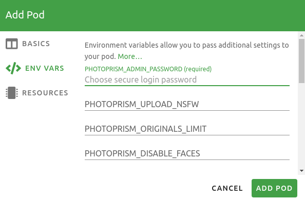
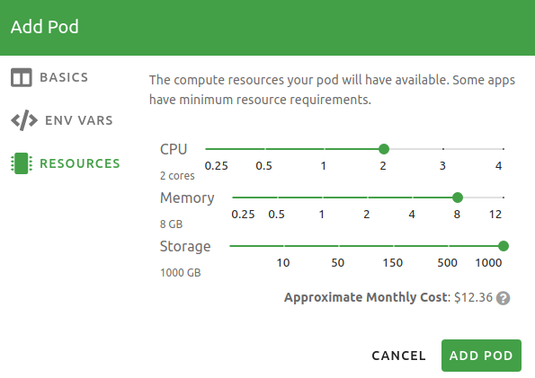

# **PikaPods** Open Source App Hosting

!!! verified "Trusted Partner"
    PhotoPrism has partnered [with PikaPods](https://prism.ws/pikapods-com) to offer you this **officially supported, cloud-hosted solution**. Your personal app instance is ready to use in just a few steps and [includes sponsor features](https://photoprism.app/membership) like interactive world maps and dark themes - at no additional cost! New customers also currently receive a **$5 welcome credit**.

## Setting Up Your Pod

This step-by-step guide explains how to set up a new PhotoPrism instance at PikaPods.

### 1. Create Account

Sign up at [www.pikapods.com/register](https://prism.ws/pikapods-register) with your contact details.
You will then receive a confirmation email with an activation link that you must click to continue.

Before proceeding, please also provide your credit card details to avoid usage restrictions.

### 2. Start PhotoPrism

- Go to [Available Apps](https://prism.ws/pikapods-apps) and select PhotoPrism 
- Click *Run Your Own*

- Enter a Pod Name and select a Region

{ class="shadow" }

- Click *ENV VARS* to specify the initial password for the "admin" user account

{ class="shadow" }

- In *RESOURCES*, you can configure the storage space available for photos and videos, as well as the compute resources PhotoPrism can use, such as for indexing and face recognition

!!! info ""
    PhotoPrism currently requires **at least 2 CPUs and 8 GB of memory**. We are working to lower these minimum requirements.

- The approximate price per month is shown at the bottom

{ class="shadow" }

- Click *Add Pod* to complete the setup

### 3. Sign In

PhotoPrism is now fully set up and ready to use. To log in, click *Open Pod*, enter the username "admin" and the password you have specified:

## Next Steps

1. [Choose](../../user-guide/library/index.md) whether you want to [index your originals](../../user-guide/library/originals.md) so that the existing file and folder names are preserved, or [import them](../../user-guide/library/import.md) so that they are automatically organized by year and month.
2. To add pictures, you can either copy them to the *import* or *originals* folder [using WebDAV](../../user-guide/sync/webdav.md), or [upload them with a browser](../../user-guide/library/upload.md), which will import them automatically after upload.
3. Finally, set up [automatic syncing](../../user-guide/sync/mobile-devices.md) from your mobile phone and install the [Progressive Web App (PWA)](../../user-guide/pwa.md) on your desktop, tablet, and phone home screens as needed.
